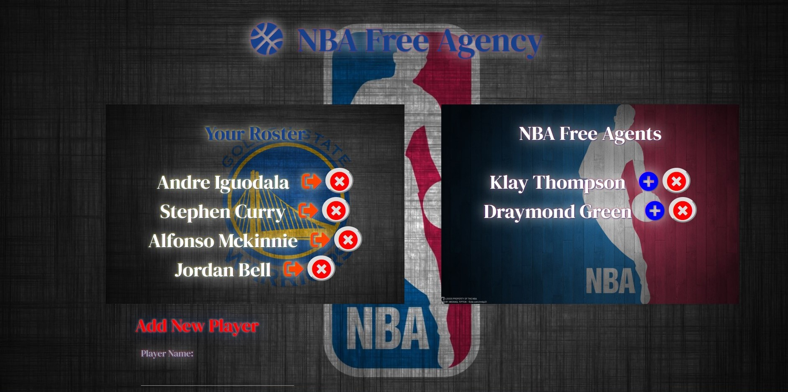

# NBA-Free-Agency

[Deployed Link](https://free-agency-nba.herokuapp.com/)

### Landing Page

### Website In Action

## Description

It is the hottest time of the year! That's right it is NBA Free Agency where major strategic shifts can alter the outcome of the next NBA season. Use the NBA Free Agency app and be on the top of your game to add new free agents, trade current players and agents to and from your roster or retire players from the league. 

The power is in your hands...

### How to Use: 

1. There are three different buttons:
    * Trade sign - to trade your current player on your roster and make him a free agent
    * Add sign - to add free agent to your roster
    * X sign - to retire the player from the league
    
2. You can also add a new player to your roster or to the free agency by filling out the "Add Player Form" and select if        they are a free agent or on your roster.

# Technologies Used

* HTML
* CSS
* MaterializeCSS
* AnimateCSS
* Javascript
* jQuery
* Express
* MySQL
* Node.js
* NPM packages
 --> express, body-parser

# Author

Phillip Chang
